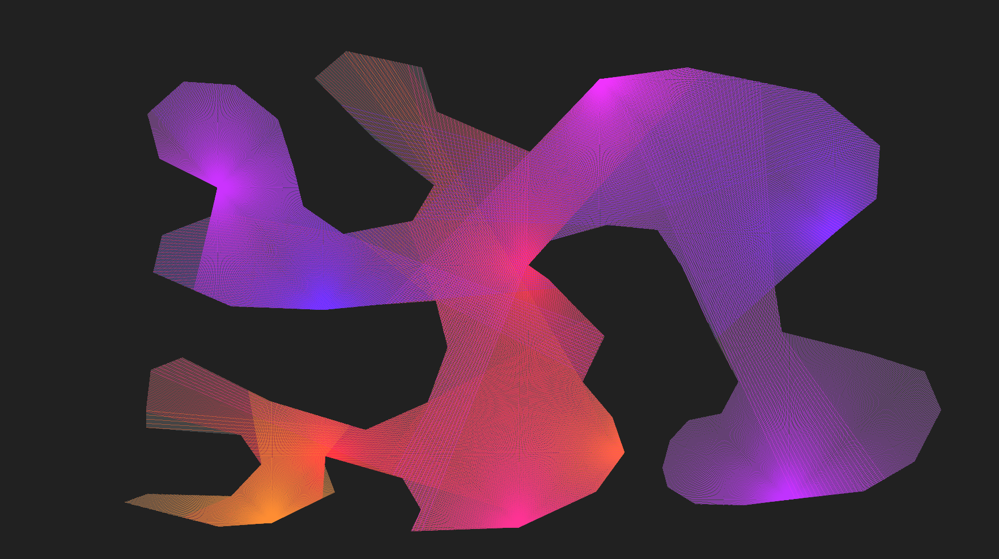
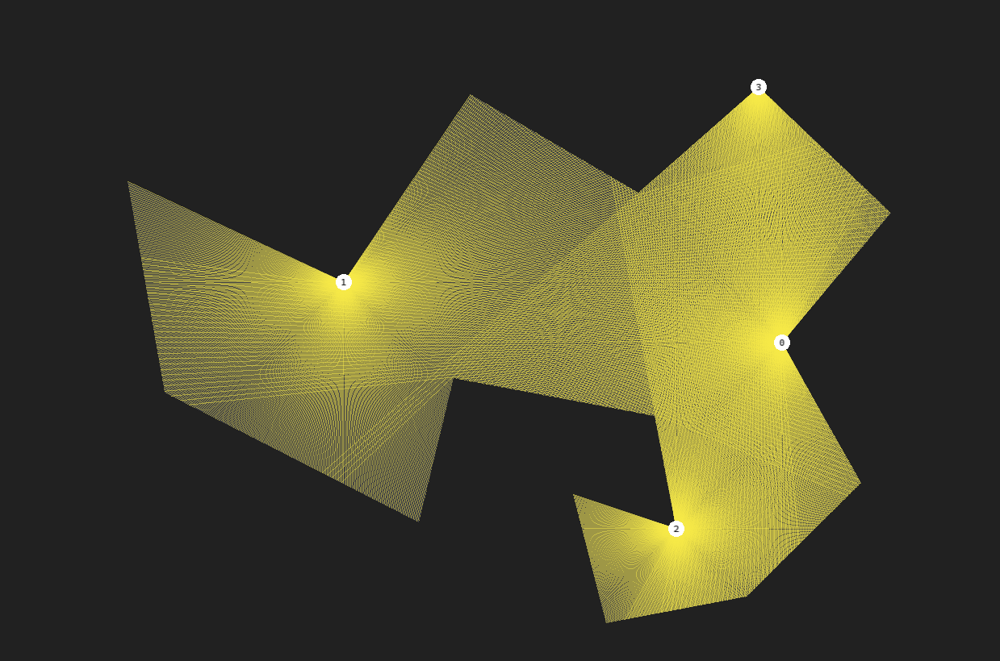

# Курсовая работа - решение задачи о галерее искусств

__Задача__ — Задана художественная галерея в форме выпуклого (невыпуклого) многоугольника. Требуется расставить минимальное количество охранников, которые видят каждую точку художественной галереи.

__Математичекая модель__ — Для простого многоугольника P и целого минимально возможного числа k требуется решить, существует ли набор G из k охранников внутри P, такой, что каждая точка p ∈ P видна хотя бы одному охраннику g ∈ G. Каждый охранник соответствует точке в многоугольнике P , и мы говорим , что охранник g видит точку p, если отрезок прямой pg содержится в P.

### Дополнительно

Я исползьовал алгоритм Субир Кумара Гоши (не знаю как точно пишется). Программа не реализована полностью. Мне пришлось придумать самостоятельно алгоритм разбиения многоугольника на компоненты видимости. Я также хотел изначально написать алгоритм для многоугольников с отверстиями в том числе, но не успел, возможно в будущем сделаю, можете помочь в релазации этого, буду очень рад. 



На текущий момент есть один баг, на этапе разбиения многоугольника на компоненты видимости, если две вершины являются соседними и одна из них рефлексная (вогнута относительно контура многоугольника), а другая выпуклая, то луч видимости, который должен создавать разбиение не всегда рисуется (возможно дело в порядке обхода вершин). И от этого результат не может быть теоретически верным на 100%.

Я также считаю, что не стоит искать минимальное количество вершинных защитников, так как оптимальное решение более качественное с точки зрения сложности выполнения и постоты реализации, возмжоно в будущем я добавлю сравнение эффективности оптимального и минимального решений в моем 
"приложении". 

### Полезные вещи

Я реализовал "обертку" над SFML для рисования многоугольников с вогнутыми вершинами, изначально библиотека это не поддерживает. Для этого я использую триангуляцию замятающей прямой с выполнением условия Делоне из библиотеки CGAL, сложность которой O(n log n), что в действительности здорово, возможно это будет кому-то полезно, метод называется `DrawPolygon()` в классе `polygon-with-holes.h`. 

### Компиляция

Пример обзора охранника на языке C (демонстрация трассировки лучей)
```
    cd /c-example
    gcc -o start ray-tracing.c $(sdl2-config --cflags --libs) -lm
```

## Сборка

Требуется установленная библиотека CGAL (>= 5.0).  
Пример установки на Ubuntu:

```bash
sudo apt-get install libcgal-dev
```

### Сторонние библиотеки

- CGAL ([GPL/LGPL](https://www.cgal.org/license.html))  
  Используется для построения триангуляции Делоне.